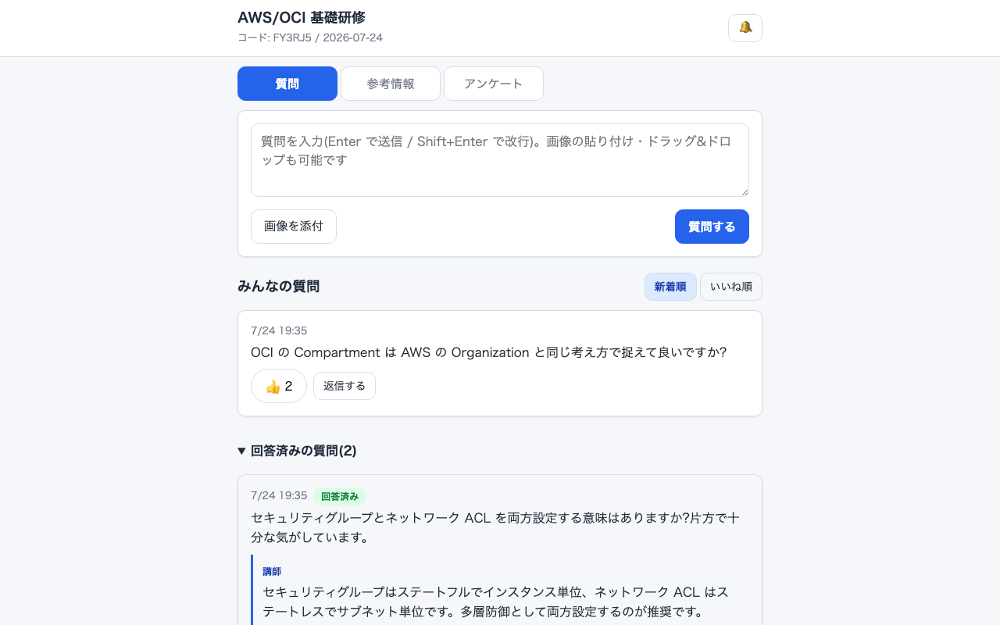
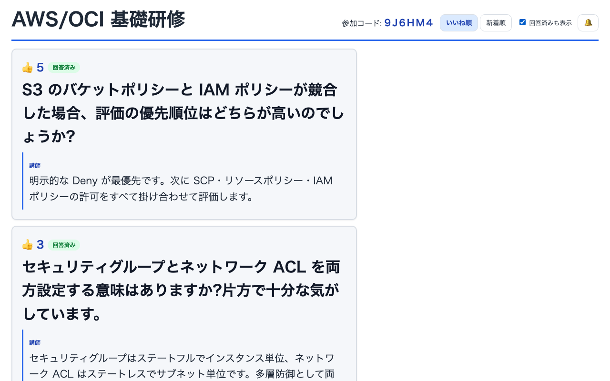

# anon-qa

トレーニング(研修)用の完全匿名 Q&A アプリ。Cloudflare Workers 単体構成(Workers Static Assets + D1 + R2 + Durable Objects + Turnstile + Cron Triggers)。

| 参加者: 質問一覧 | 講師: 投影モード |
|---|---|
|  |  |

- 匿名質問(画像添付可)・いいね投票・自分の質問の編集/削除
- 講師回答・回答済み管理・リアルタイムアンケート・参考情報共有・テンプレート
- セッションは作成から 30 日で自動削除(D1 + R2)
- 仕様の詳細は [requirements.md](requirements.md) を参照

## 開発

```bash
npm install
npx wrangler d1 migrations apply anon-qa-db --local   # ローカル DB にスキーマ適用
npm run dev                                           # http://localhost:8787
```

- ローカルでは Turnstile はテストキー(常に成功)で動作します
- ローカルの admin パスワード等は `.dev.vars` で設定します(`.dev.vars.example` 参照)

```bash
npm run lint          # 型チェック (tsc --noEmit)
npm test              # vitest (@cloudflare/vitest-pool-workers)
npm run test:coverage # カバレッジ計測(istanbul プロバイダ、閾値による合否判定はなし)
```

E2E(Playwright)は `npm run dev` を別ターミナルで起動した状態で実行します(初回のみ `npx playwright install chromium`)。

```bash
npm run e2e:ui    # 講師 2 ペイン UI(sticky・回答送信)
npm run e2e:main  # 主要導線: 入室 → 質問 → 投票 → 講師回答 → 投影
```

## 初回セットアップ(本番)

1. 環境変数を設定(未設定だと setup.sh は即エラー終了します)

   ```bash
   export CLOUDFLARE_ACCOUNT_ID=<アカウント ID>   # ダッシュボード右側 or `npx wrangler whoami`
   export CLOUDFLARE_API_TOKEN=<API トークン>     # Workers/D1/R2/Turnstile の編集権限が必要
   ```

2. `bash scripts/setup.sh`
   - D1 database / R2 bucket / Turnstile widget を作成
   - `ADMIN_PASSWORD` / `TURNSTILE_SECRET_KEY` / `APP_SECRET` を secret 登録
   - 冪等なので何度実行しても安全(作成済みリソース・登録済み secret はスキップ)
3. 出力された `database_id` と Turnstile site key を `wrangler.jsonc` に反映して commit
4. GitHub リポジトリの Secrets に `CLOUDFLARE_API_TOKEN` / `CLOUDFLARE_ACCOUNT_ID` を登録
5. `main` へ push → GitHub Actions が D1 migrations apply → `wrangler deploy` を実行

以降の変更はすべて git push のみで反映されます。手動デプロイは緊急時のみ `npm run deploy`。

### このリポジトリを fork して使う場合

`wrangler.jsonc` の以下はこのリポジトリのオーナーのアカウント固有値なので、自分の値に書き換えてください(いずれもシークレットではなく公開可能な値です)。

| 項目 | 対応 |
|---|---|
| `routes`(カスタムドメイン `qa.maijun.net`) | 自分のドメインに変更。ドメインがなければ `routes` を削除し `workers_dev` を `true` に |
| `d1_databases[0].database_id` | setup.sh が出力した自分の D1 の ID に置き換え |
| `vars.TURNSTILE_SITE_KEY` | 自分の Turnstile widget の site key に置き換え |

Turnstile widget の許可ドメイン(ダッシュボード → Turnstile → Domains)に運用するホスト名を登録するのを忘れずに。

## 使い方

### 講師(管理者)

1. `/admin` に `ADMIN_PASSWORD` でログイン
2. ダッシュボードでセッションを作成 → アクセスコード(例: `AB3D5F`)が発行される
3. 参加者にコードまたは入室 URL(`/?code=AB3D5F`)を共有(QR コード等で案内)
4. `/admin/s/:id` で質問の確認・回答・回答済み管理、参考情報の共有、アンケートの配信を行う
5. スクリーン投影には `/admin/s/:id/present`(投影モード)を使用

### 参加者(受講者)

1. トップページでアクセスコードを入力して入室(Turnstile 検証あり、初回のみ)
2. 質問を投稿(完全匿名、画像はファイル選択・ペースト・ドラッグ&ドロップで添付可、5MB まで)
3. 他の人の質問に「いいね」投票、自分の質問は編集・削除が可能
4. 講師の回答・参考情報・アンケートはリアルタイムに反映される

セッションは作成から 30 日で自動削除されます(質問・画像を含む)。

## 画面

| パス | 内容 |
|---|---|
| `/` | 入室(アクセスコード + Turnstile) |
| `/s/:code` | 参加者ページ(質問 / 参考情報 / アンケート) |
| `/admin` | 講師ログイン |
| `/admin/dashboard` | セッション / テンプレート管理 |
| `/admin/s/:id` | セッション管理(質問 / 参考情報 / アンケート配信) |
| `/admin/s/:id/present` | 投影モード(大画面表示) |

## 運用: 認証情報の失効(ローテーション)

- admin セッション Cookie はサーバ側で個別に失効できません(HMAC 署名トークンで最長 12 時間有効)。
  `/api/admin/logout` はクライアント側の Cookie 削除のみで、発行済みトークン自体は無効になりません。
- 漏洩が疑われる場合は、速やかに以下を実施してください。
  1. `npx wrangler secret put APP_SECRET` で新しいランダム値に差し替える
     → 発行済みの admin Cookie と参加者の入室トークンが**両方とも**無効になります(署名検証が
     すべて `APP_SECRET` に依存するため)。参加者は Turnstile 再検証を伴う再入室が必要になります。
  2. `npx wrangler secret put ADMIN_PASSWORD` で `ADMIN_PASSWORD` を変更する
     → 次回ログイン以降は新パスワードが必要になりますが、**このステップだけでは発行済みの
     admin Cookie は失効しません**(Cookie の署名は `APP_SECRET` のみに依存するため)。
     Cookie も失効させたい場合は上記 1 も併せて実施してください。

## セキュリティ

- 全 HTML ページに Content-Security-Policy を付与(script は自ホストと Turnstile のみ許可)
- Rate limit は「IP + 端末単位トークンハッシュ」の複合キーで、教室 WiFi(NAT)で同一 IP を
  共有する参加者同士が制限を食い合わない設計
- admin ログインの失敗は IP 別 + グローバルの 2 段で制限し、グローバル超過時も
  指数バックオフ(最長 10 分)後に再試行できる(攻撃による講師の完全ロックアウトを防止)
- 添付画像は SVG 拒否 + 配信時 sandbox CSP の二重防御

## 匿名性について

- IP アドレス・User-Agent は DB にもログにも保存しない(rate limit のキーに使う IP・
  トークンハッシュも Durable Object のメモリ内カウンタのみで、永続化しない)
- ブラウザトークン(`crypto.randomUUID()`)は SHA-256 ハッシュのみ D1 に保存し、本人の投稿編集/削除判定と投票重複防止のみに使用
- 講師を含め誰も質問者を特定できない(トークンハッシュは API レスポンスに含めない)
- これらはテスト(`test/anonymity.test.ts`)で担保している

## License

MIT License。詳細は [LICENSE](LICENSE) を参照してください。
